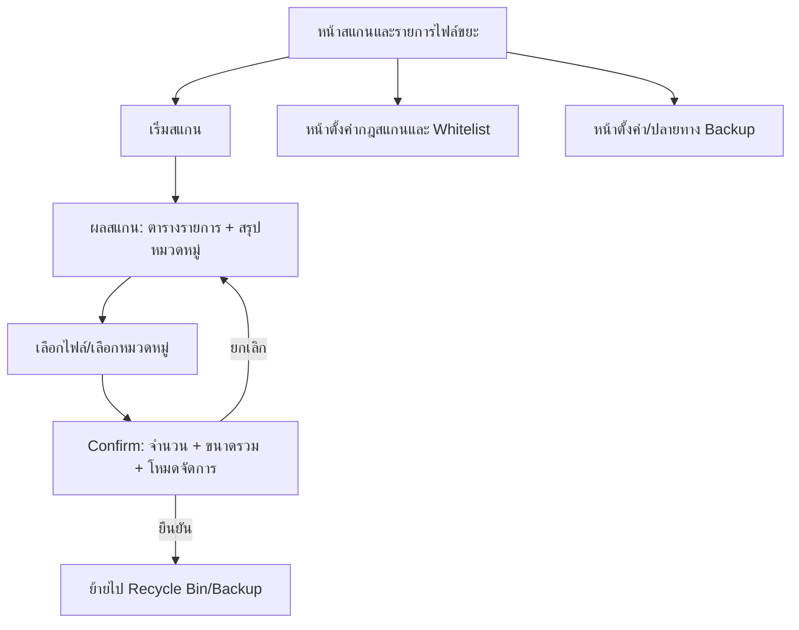

## 1. Product Overview
ระบบสแกน “ไฟล์ขยะ” ภายในโปรเจกต์เพื่อช่วยค้นหาไฟล์/โฟลเดอร์ที่ไม่จำเป็น และลบได้อย่างปลอดภัย
แสดงรายการพร้อมขนาด/วันที่/ประเภท เลือกลบรายไฟล์หรือรายหมวดหมู่ พร้อมยืนยันก่อนลบ และรองรับ whitelist

## 2. Core Features

### 2.1 User Roles
ไม่จำเป็นต้องแยกบทบาทผู้ใช้ (ใช้งานแบบเครื่องมือภายในโปรเจกต์)

### 2.2 Feature Module
ระบบประกอบด้วยหน้าหลักดังนี้:
1. **หน้าสแกนและรายการไฟล์ขยะ**: เลือกโปรเจกต์/โฟลเดอร์, ตั้งค่าโหมดการลบ (Recycle Bin/Backup), สแกนและแสดงผล, จัดกลุ่มตามหมวดหมู่, เลือกและลบ
2. **หน้าตั้งค่ากฎสแกนและ Whitelist**: ตั้งค่าหมวดหมู่ไฟล์ขยะ, กำหนดเงื่อนไขค้นหา, จัดการ whitelist
3. **หน้าตั้งค่า/ปลายทาง Backup**: กำหนดโฟลเดอร์สำรอง, ตรวจสอบสรุปการทำงานล่าสุด (เช่น จำนวนไฟล์/ขนาดรวมที่ถูกย้ายไป backup)

### 2.3 Page Details
| Page Name | Module Name | Feature description |
|-----------|-------------|---------------------|
| หน้าสแกนและรายการไฟล์ขยะ | เลือกขอบเขตสแกน | เลือกโฟลเดอร์โปรเจกต์/โฟลเดอร์ย่อยที่จะสแกน |
| หน้าสแกนและรายการไฟล์ขยะ | ตั้งค่าโหมดจัดการไฟล์ก่อนลบ | เลือกวิธีจัดการ: “ย้ายไป Recycle Bin” หรือ “ย้ายไป Backup Folder” |
| หน้าสแกนและรายการไฟล์ขยะ | เริ่มสแกนและแสดงสถานะ | เริ่ม/ยกเลิกสแกน และแสดงสถานะการทำงาน (กำลังสแกน/เสร็จสิ้น/ผิดพลาด) |
| หน้าสแกนและรายการไฟล์ขยะ | ตารางรายการไฟล์ขยะ | แสดงรายการไฟล์พร้อม “ขนาด / วันที่แก้ไขล่าสุด / ประเภท(นามสกุล)/พาธ / หมวดหมู่” และรองรับ sort/filter ขั้นพื้นฐาน |
| หน้าสแกนและรายการไฟล์ขยะ | สรุปตามหมวดหมู่ | แสดงรายการหมวดหมู่ (เช่น log, cache, build artifacts, temp ฯลฯ) พร้อมจำนวนไฟล์และขนาดรวมของหมวดนั้น |
| หน้าสแกนและรายการไฟล์ขยะ | การเลือกเพื่อจัดการ | เลือกได้แบบรายไฟล์และเลือกทั้งหมวดหมู่ (select all in category) พร้อมแสดง “จำนวนที่เลือก/ขนาดรวมที่เลือก” |
| หน้าสแกนและรายการไฟล์ขยะ | การลบพร้อมยืนยัน (Confirm) | กดลบแล้วเปิด dialog ยืนยัน โดยแสดงจำนวนไฟล์, ขนาดรวม, โหมด (Recycle Bin/Backup) และรายการสรุปตามหมวดหมู่ ก่อนยืนยัน |
| หน้าสแกนและรายการไฟล์ขยะ | Whitelist guard | ตัดรายการที่เข้า whitelist ออกจากผลสแกน และแจ้งเหตุผลว่า “ถูก whitelist” |
| หน้าตั้งค่ากฎสแกนและ Whitelist | จัดการหมวดหมู่ไฟล์ขยะ | เพิ่ม/แก้ไข/เปิด-ปิดหมวดหมู่ และกำหนดแพตเทิร์นไฟล์/โฟลเดอร์สำหรับหมวดนั้น |
| หน้าตั้งค่ากฎสแกนและ Whitelist | จัดการ whitelist | เพิ่ม/ลบรายการ whitelist ด้วยรูปแบบ path/pattern และกำหนดขอบเขต (ทั้งโปรเจกต์/เฉพาะโฟลเดอร์) |
| หน้าตั้งค่า/ปลายทาง Backup | ตั้งค่าโฟลเดอร์สำรอง | ระบุ path โฟลเดอร์ backup และกฎการตั้งชื่อโฟลเดอร์สำรองต่อการลบหนึ่งครั้ง |
| หน้าตั้งค่า/ปลายทาง Backup | สรุปการทำงานล่าสุด | แสดงสรุปครั้งล่าสุด: จำนวนไฟล์ที่ย้าย, ขนาดรวม, ตำแหน่งปลายทาง (Recycle Bin/Backup) |

## 3. Core Process
**Flow ผู้ใช้**
1) คุณเปิดหน้าสแกน เลือกโฟลเดอร์โปรเจกต์ และกำหนดโหมด “Recycle Bin” หรือ “Backup”
2) คุณเริ่มสแกน ระบบแสดงรายการไฟล์ขยะพร้อมขนาด/วันที่/ประเภท และสรุปตามหมวดหมู่
3) คุณเลือกไฟล์เป็นรายไฟล์หรือเลือกทั้งหมวดหมู่ ตรวจสอบ “จำนวน/ขนาดรวมที่เลือก”
4) คุณกดลบ ระบบแสดงหน้าต่างยืนยัน (confirm) พร้อมขนาดรวมและสรุปหมวดหมู่
5) คุณยืนยัน ระบบย้ายไฟล์ไป Recycle Bin หรือโฟลเดอร์ backup ตามที่ตั้งค่า และแสดงผลลัพธ์
6) หากไฟล์/โฟลเดอร์ถูก whitelist ระบบไม่เสนอให้ลบ และแสดงสถานะว่า whitelist

