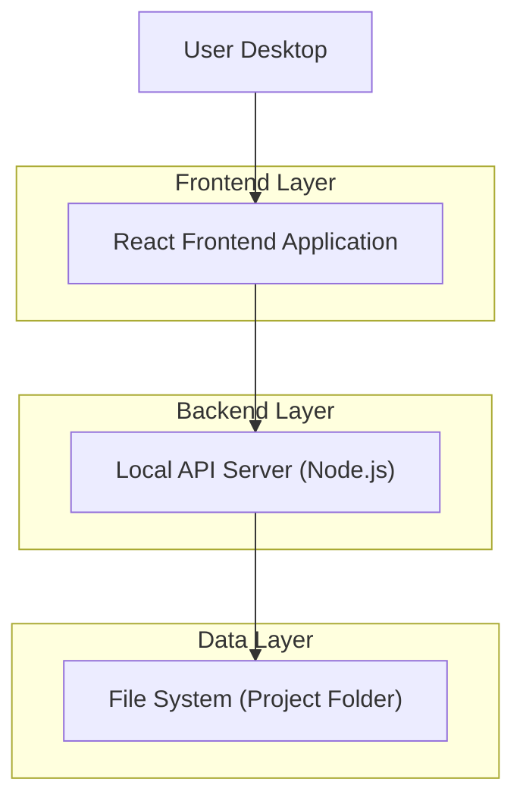
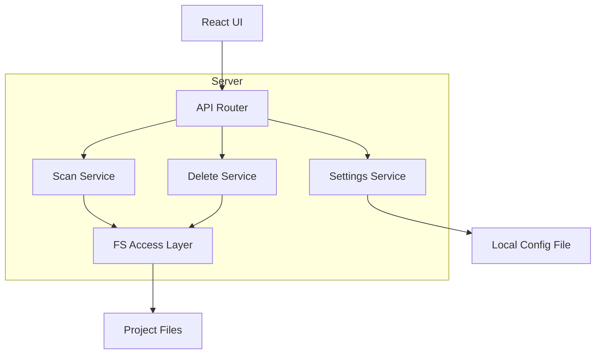

## 1.Architecture design


## 2.Technology Description
- Frontend: React@18 + TypeScript + vite + tailwindcss@3
- Backend: Node.js (Express@4) + TypeScript
- Storage/Config: Local JSON file (เช่น `.trashscan/config.json`) สำหรับ rules/whitelist/backup settings

## 3.Route definitions
| Route | Purpose |
|-------|---------|
| /scan | หน้าสแกนและรายการไฟล์ขยะ: สแกน/ดูรายการ/เลือกและลบ |
| /rules | หน้าตั้งค่ากฎสแกนและ Whitelist |
| /backup | หน้าตั้งค่า/ปลายทาง Backup และสรุปการทำงานล่าสุด |

## 4.API definitions (If it includes backend services)
### 4.1 TypeScript shared types
```ts
export type DeleteMode = "recycle_bin" | "backup";

export type TrashCategory = {
  id: string;              // e.g. "logs", "cache", "build"
  name: string;            // label for UI
  enabled: boolean;
  includeGlobs: string[];  // patterns to match
  excludeGlobs?: string[]; // optional
};

export type WhitelistRule = {
  id: string;
  pattern: string;         // path/glob
  note?: string;
};

export type FileItem = {
  path: string;
  relativePath: string;
  sizeBytes: number;
  modifiedAt: string;      // ISO
  ext: string;             // file extension
  categoryId: string;
  whitelisted: boolean;
};

export type ScanResult = {
  scannedRoot: string;
  generatedAt: string;     // ISO
  items: FileItem[];
  byCategory: Array<{
    categoryId: string;
    count: number;
    totalSizeBytes: number;
  }>;
};
```

### 4.2 Core API
สแกนไฟล์ขยะ
```
POST /api/scan
```
Request:
| Param Name | Param Type | isRequired | Description |
|---|---:|---:|---|
| rootPath | string | true | โฟลเดอร์โปรเจกต์ที่จะสแกน |
| enabledCategoryIds | string[] | true | หมวดหมู่ที่เปิดใช้งาน |
Response: `ScanResult`

ลบ/ย้ายไฟล์ตามที่เลือก (รองรับเลือกเป็นรายไฟล์หรือทั้งหมวดหมู่จากฝั่ง UI)
```
POST /api/delete
```
Request:
| Param Name | Param Type | isRequired | Description |
|---|---:|---:|---|
| mode | DeleteMode | true | โหมดจัดการไฟล์ก่อนลบ |
| filePaths | string[] | true | รายการ path ที่จะดำเนินการ |
Response:
| Param Name | Param Type | Description |
|---|---:|---|
| movedCount | number | จำนวนไฟล์ที่ถูกย้ายสำเร็จ |
| movedTotalSizeBytes | number | ขนาดรวมที่ย้ายสำเร็จ |

อ่าน/บันทึกการตั้งค่า rules/whitelist/backup
```
GET /api/settings
PUT /api/settings
```

## 5.Server architecture diagram (If it includes backend services)

