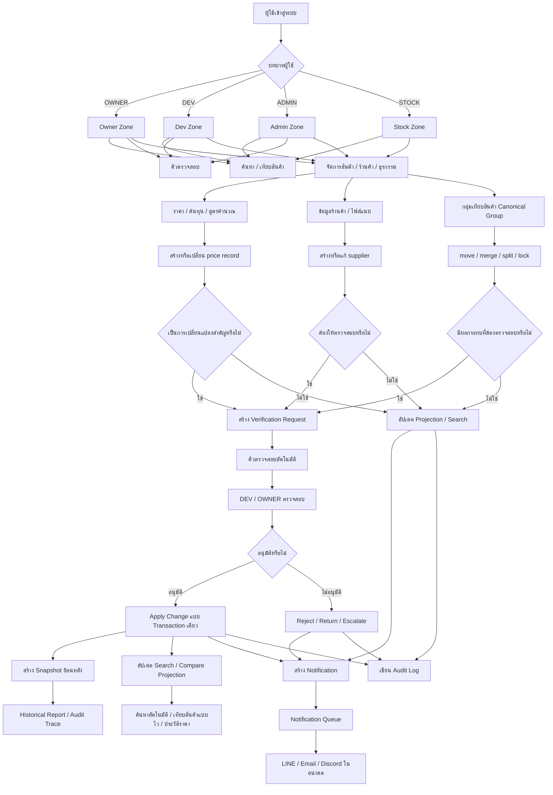
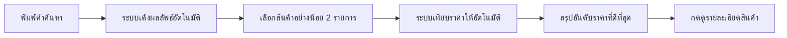
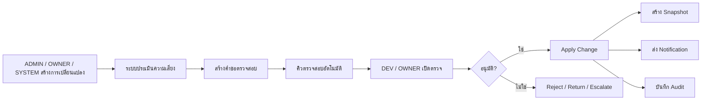
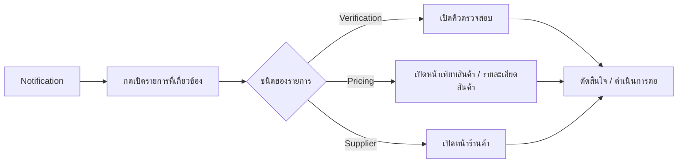

# FlowChart การทำงานของทั้งระบบ

เอกสารนี้ใช้ดูภาพรวมว่าระบบทำงานอย่างไรตั้งแต่ต้นจนจบ และข้อมูลแต่ละส่วนไหลไปทางไหน

## 1. ภาพรวมระบบทั้งหมด

## 2. Flow หลักที่ผู้ใช้เจอบ่อยที่สุด

### 2.1 ค้นหา → เทียบสินค้า → เปิดรายละเอียด

### 2.2 เปลี่ยนข้อมูลสำคัญ → ตรวจสอบ → อนุมัติ → แจ้งเตือน

### 2.3 Notification → เปิดรายการที่เกี่ยวข้อง → ทำงานต่อ

## 3. ระบบย่อยสำคัญเกี่ยวข้องกันอย่างไร

- `Supplier` เป็นฐานข้อมูลร้านค้าและไฟล์แนบ
- `Pricing / Cost / Formula` เป็นฐานราคาที่ใช้เทียบ
- `Matching` ทำให้สินค้าคล้ายกันถูกเทียบในกลุ่มเดียวกันได้
- `Verification` ควบคุมการเปลี่ยนแปลงสำคัญ
- `Search / Compare` ใช้ projection เพื่อให้ค้นหาและเทียบได้เร็ว
- `Notifications` ใช้แจ้งงานสำคัญและพาไปยังหน้าที่เกี่ยวข้อง
- `Snapshots` ใช้ตรึงข้อมูลย้อนหลังเพื่อรายงานและ audit

## 4. ใช้ Snapshot ตอนไหน

- ตอน approve งานสำคัญ
- ตอนเปลี่ยนราคา critical
- ตอนต้องดูรายงานย้อนหลังที่ห้ามเปลี่ยนตาม live data

## 5. ใช้ Live Data ตอนไหน

- ตอนค้นหาสินค้า
- ตอนเทียบสินค้าแบบไว
- ตอนดูคิวตรวจสอบล่าสุด
- ตอนดูการแจ้งเตือนล่าสุด

## 6. ลำดับการใช้งานจริงที่แนะนำ

1. เตรียมสินค้า / ร้านค้า / ราคา
2. จัดกลุ่มเทียบสินค้าให้ถูก
3. ใช้ค้นหาอัตโนมัติและเทียบสินค้าแบบไว
4. ถ้ามีงานสำคัญ ให้ดูที่คิวตรวจสอบอัตโนมัติ
5. อนุมัติแล้วค่อยดู snapshot / notification / audit ย้อนหลัง
